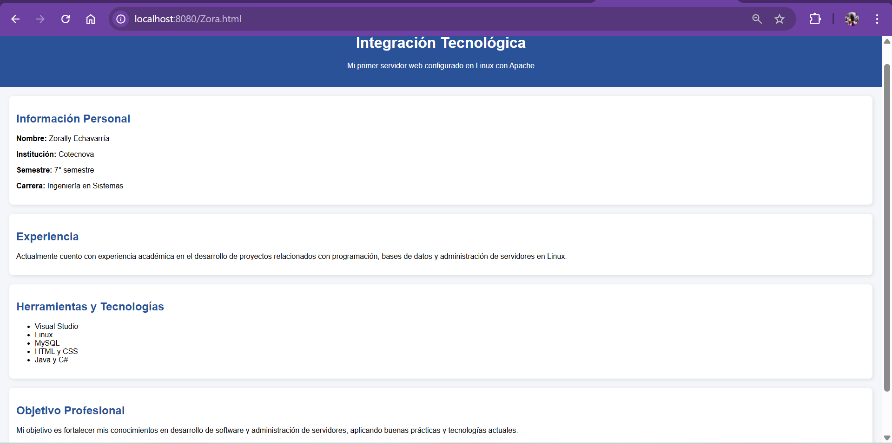
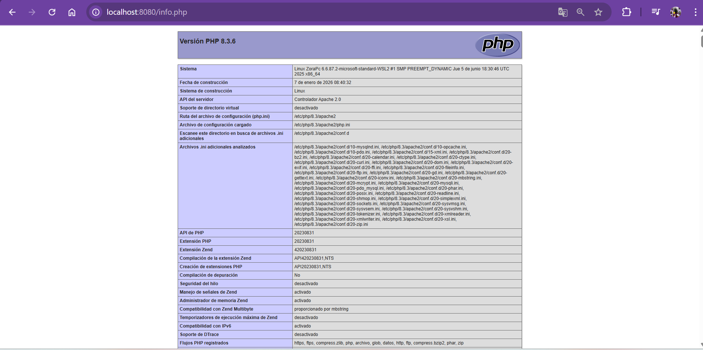

# LABORATORIO LAMP - INTEGRACIÓN TECNOLÓGICA

## 1. ¿Qué es Apache?

Apache es un servidor web de código abierto que permite alojar y servir páginas web a través de internet o en un entorno local. 
Es uno de los servidores más utilizados en el mundo y funciona mediante el protocolo HTTP.

En este laboratorio se utilizó Apache para alojar una página web en un entorno Linux.

---

## 2. ¿Qué es LAMP?

LAMP es un conjunto de tecnologías utilizadas para el desarrollo web:

- **L**: Linux (Sistema Operativo)
- **A**: Apache (Servidor Web)
- **M**: MySQL (Base de Datos)
- **P**: PHP (Lenguaje de programación)

Estas herramientas trabajan juntas para crear aplicaciones web dinámicas.

---

## 3. Diferencia entre Apache y NGINX

| Apache | NGINX |
|--------|--------|
| Basado en procesos | Basado en eventos |
| Más configurable con .htaccess | Más eficiente en alto tráfico |
| Fácil de usar para principiantes | Más rápido en servidores grandes |
| Muy compatible con PHP | Mejor rendimiento en contenido estático |

---

## 4. Evidencias

### Página localhost

### PHP funcionando

### phpMyAdmin

---

## 5. Archivo HTML

Se adjunta el archivo HTML desarrollado en clase para la actividad de Integración Tecnológica.
[Descargar HTML](Zora.html)
